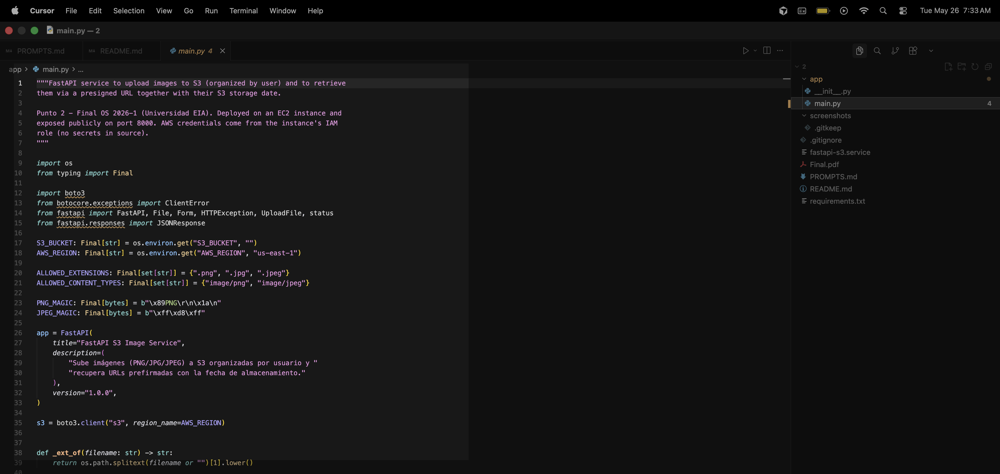
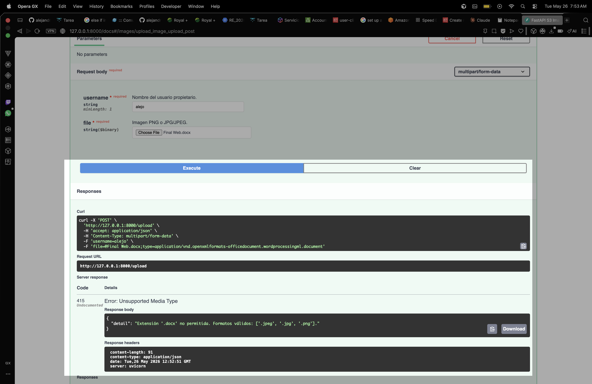
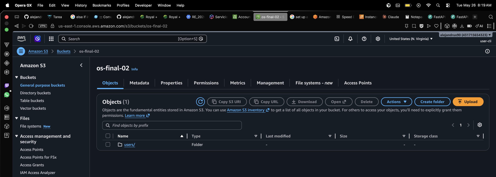
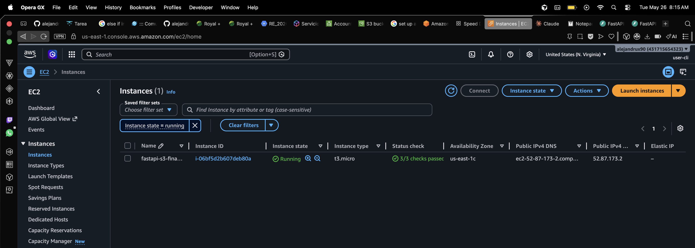
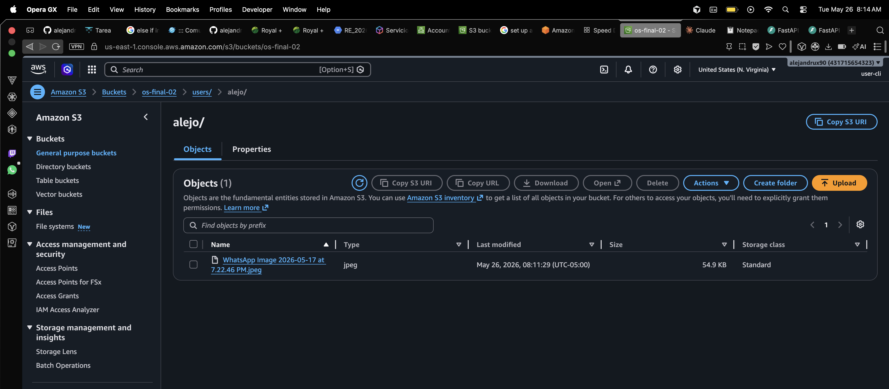

# Final OS 2026-1 — Punto 2: FastAPI en EC2 + S3 (subida y consulta de imágenes)

**Estudiante:** Alejandro Urrego Giraldo
**Asignatura:** Sistemas Operativos — Universidad EIA, 2026-1
**Herramienta de IA utilizada:** [Claude Code](https://claude.com/claude-code) (Anthropic, modelo `claude-opus-4-7`). El chat ocurre en la terminal y **no genera un enlace público compartible**, por lo que la transcripción completa de prompts y respuestas queda registrada en [`PROMPTS.md`](./PROMPTS.md) como evidencia del proceso (mismo criterio aplicado al Punto 1).

---

## Resumen del ejercicio

Aplicación FastAPI que expone dos endpoints (uno `POST` para subir imágenes PNG/JPG/JPEG validadas en tres capas — extensión, `Content-Type` y *magic bytes* — y uno `GET` para devolver una **URL prefirmada** y la **fecha de almacenamiento** desde los metadatos del objeto). Los archivos se guardan en un bucket S3 privado con el prefijo `users/<username>/`. La aplicación se ejecuta en una instancia EC2 (Amazon Linux 2023) como servicio gestionado por **systemd**, expuesta públicamente en el puerto `8000`. La autenticación contra S3 se hace mediante un **rol IAM asociado a la instancia** — no se almacenan credenciales en el código.

---

> ### Aviso al profesor — la instancia no se mantiene en línea
>
> Las pruebas, capturas (sub-ítems **g**, **h**, **i**) y la verificación del servicio se realizan con la instancia EC2 activa, pero **la instancia se apaga / termina inmediatamente después de tomar las evidencias**. EC2 cobra por hora de cómputo y por IP pública asignada, y mantener el servicio corriendo más tiempo del estrictamente necesario consume rápidamente los créditos de AWS Academy / Free Tier disponibles para el semestre.
>
> Por esta razón, si al momento de calificar la URL pública `http://<EC2-IP>:8000/docs` **no responde**, eso es esperado: la evidencia de funcionamiento queda capturada en las screenshots **08 a 13** (instancia *running*, Security Group abierto, `systemctl status` activo, Swagger público devolviendo `201`/`200` y el objeto correspondiente en S3). Todos los artefactos del repo (`app/`, `fastapi-s3.service`, `requirements.txt`) son suficientes para reproducir el despliegue en cualquier momento siguiendo la guía paso a paso del sub-ítem **g** y **h**.

---

## Arquitectura

```
                          Internet
                              │
                              ▼
                ┌──────────────────────────┐
                │  Security Group :8000    │  ← inbound 0.0.0.0/0 → TCP 8000
                └──────────────┬───────────┘
                               ▼
              ┌─────────────────────────────────┐
              │  EC2 (Amazon Linux 2023)        │
              │  ┌───────────────────────────┐  │
              │  │ systemd: fastapi-s3.svc   │  │
              │  │   └─ uvicorn :8000        │  │
              │  │      └─ FastAPI app       │  │
              │  └─────────┬─────────────────┘  │
              │            │ boto3 (IAM Role)   │
              └────────────┼─────────────────────┘
                           ▼
                   ┌──────────────────┐
                   │  S3 bucket        │
                   │  users/<user>/*   │  ← privado, presigned URLs
                   └──────────────────┘
```

---

## Archivos del repositorio

| Archivo | Propósito |
|---|---|
| `app/main.py` | Aplicación FastAPI: validaciones + boto3 a S3 (sub-ítems **a–e**). |
| `app/__init__.py` | Marker de paquete (vacío). |
| `requirements.txt` | Dependencias: `fastapi`, `uvicorn[standard]`, `boto3`, `python-multipart`. |
| `fastapi-s3.service` | Unit file de **systemd** para ejecutar la app como servicio en EC2 (sub-ítem **h**). |
| `guide.md` | Guía paso a paso de despliegue (local + AWS), pensada para reproducir el ejercicio de cero. |
| `README.md` | Este documento (resumen para calificación). |
| `PROMPTS.md` | Transcripción del chat con Claude Code (evidencia de IA). |
| `screenshots/` | Capturas de pantalla (13 archivos, ver índice al final). |
| `.gitignore` | Ignora `.venv/`, `__pycache__/`, `.DS_Store`, etc. |

---

## Endpoints expuestos

| Método | Ruta | Descripción | Códigos |
|---|---|---|---|
| `GET` | `/` | Healthcheck (`{"status":"ok"}`). | `200` |
| `POST` | `/upload` | Sube imagen PNG/JPG/JPEG a `s3://<bucket>/users/<username>/<filename>`. Form: `username`, `file`. | `201`, `400`, `415` |
| `GET` | `/images/{username}/{image_name}` | Devuelve presigned URL + `stored_at` (LastModified). | `200`, `404` |

Documentación interactiva (Swagger) en `/docs`.

---

## Desarrollo por sub-ítem del enunciado

### a. Endpoint `POST` que recibe nombre de usuario + imagen

Definido en `app/main.py` como `POST /upload`, recibiendo el `username` como campo `Form` y el archivo como `UploadFile`. FastAPI genera Swagger automáticamente y maneja `multipart/form-data` gracias a `python-multipart`.

```python
@app.post("/upload", status_code=201)
async def upload_image(
    username: str = Form(..., min_length=1),
    file: UploadFile = File(...),
):
    ...
```



### b. Validaciones de formato y respuesta de error 4xx

Se aplican **tres validaciones en cascada** antes de subir a S3:

1. **Extensión** — `.png`, `.jpg` o `.jpeg`. Si no, `415 Unsupported Media Type`.
2. **Content-Type** del upload — `image/png` o `image/jpeg`. Si no, `415`.
3. **Magic bytes** — los primeros 8 bytes deben corresponder a la firma real del formato (`\x89PNG\r\n\x1a\n` o `\xff\xd8\xff`). Si no, `400 Bad Request` (archivo corrupto o falsificado).

Esto evita tanto un `.txt` renombrado a `.png` como un PNG con `Content-Type` mentiroso.



### c. Almacenamiento en S3 organizado por usuario

El objeto se sube con la key `users/{username}/{file.filename}` mediante `s3.upload_fileobj(...)`, fijando además el `ContentType` correcto para que el navegador lo renderice al abrir la presigned URL.

```python
key = f"users/{username}/{file.filename}"
s3.upload_fileobj(file.file, S3_BUCKET, key,
                  ExtraArgs={"ContentType": file.content_type})
```



### d. Endpoint `GET` con nombre de usuario y nombre de imagen

`GET /images/{username}/{image_name}` — toma ambos como path params para que la URL sea legible y aproveche el routing de FastAPI.

```python
@app.get("/images/{username}/{image_name}")
def get_image(username: str, image_name: str):
    key = f"users/{username}/{image_name}"
    head = s3.head_object(Bucket=S3_BUCKET, Key=key)
    ...
```


### e. Verificación de existencia, presigned URL y fecha desde metadatos

- **Existencia**: se usa `s3.head_object`; si lanza `ClientError` con código `404`/`NoSuchKey`/`NotFound`, el endpoint devuelve `404` con un mensaje explícito indicando qué imagen y qué usuario no se encontraron.
- **URL prefirmada**: `s3.generate_presigned_url("get_object", ..., ExpiresIn=3600)` — 1 hora de validez, suficiente para inspección. Como el bucket es privado, esta es la forma estándar y segura de exponer un objeto.
- **Fecha de almacenamiento**: viene del campo `LastModified` del `head_object` (metadato nativo de S3), serializado a ISO 8601.

Ejemplo de respuesta:

```json
{
  "username": "alejandro",
  "image_name": "perfil.png",
  "bucket": "...",
  "s3_key": "users/alejandro/perfil.png",
  "stored_at": "2026-05-26T13:42:11+00:00",
  "content_type": "image/png",
  "size_bytes": 184231,
  "url": "https://...s3.amazonaws.com/...?X-Amz-Algorithm=...",
  "url_expires_in_seconds": 3600
}
```


Caso de error con mensaje claro (la imagen no existe):


### f. Validación local con Swagger (sin curl)

La aplicación corre localmente con:

```bash
python3 -m venv .venv
source .venv/bin/activate
pip install -r requirements.txt
export S3_BUCKET=<tu-bucket> AWS_REGION=us-east-1
uvicorn app.main:app --reload
```

Y se abre `http://127.0.0.1:8000/docs` en el navegador. Se prueba el `POST /upload` con una imagen válida (`200/201`) y con un `.txt` (`415`); luego el `GET /images/{username}/{image_name}` con una imagen existente (`200` + presigned URL) y con una inexistente (`404` con mensaje claro).

> Las credenciales locales de boto3 vienen de `~/.aws/credentials`. En la instancia EC2, vendrán del **rol IAM** asociado a la instancia, sin necesidad de configuración adicional.


### g. Despliegue en EC2 con acceso público

#### g.1 — Prerrequisitos AWS (consola)

1. **Bucket S3** (`us-east-1`) — *Block all public access* activado (no hace falta exponerlo; los presigned URLs son la vía pública). Nombre: `<tu-bucket>` (sustituir en los pasos siguientes).
2. **Política IAM** `ec2-fastapi-s3-policy` con el JSON mínimo:
   ```json
   {
     "Version": "2012-10-17",
     "Statement": [{
       "Effect": "Allow",
       "Action": ["s3:PutObject", "s3:GetObject", "s3:HeadObject"],
       "Resource": "arn:aws:s3:::<tu-bucket>/*"
     }]
   }
   ```
3. **Rol IAM** `ec2-fastapi-s3-role` (tipo *EC2*) con la política anterior adjunta.
4. **Instancia EC2**:
   - AMI: **Amazon Linux 2023**.
   - Tipo: `t3.micro` (o `t2.micro` si la cuenta lo limita).
   - **Instance profile**: `ec2-fastapi-s3-role`.
   - Key pair: una propia (`.pem` que ya tengas).
   - Security Group con dos reglas inbound:
     - TCP **22** desde *My IP* (SSH).
     - TCP **8000** desde `0.0.0.0/0` (Swagger público).




#### g.2 — Subir el código a la instancia

Desde mi máquina local (macOS), copio el repo a la instancia con `scp`:

```bash
# desde la raíz del repo Punto 2/
scp -i ~/.ssh/<mi-key>.pem -r \
    app fastapi-s3.service requirements.txt \
    ec2-user@<EC2-Public-IP>:/home/ec2-user/app-src/
```

> **Alternativa**: si el repo está publicado en GitHub, dentro de la instancia se puede hacer `git clone https://github.com/<usuario>/<repo>.git` directamente y saltarse el `scp`.

#### g.3 — Setup dentro de la instancia (vía SSH)

```bash
ssh -i ~/.ssh/<mi-key>.pem ec2-user@<EC2-Public-IP>

# 1. Dependencias del sistema
sudo dnf install -y python3.11 python3.11-pip git

# 2. Layout esperado por el unit file
mkdir -p /home/ec2-user/app
cp -r /home/ec2-user/app-src/app /home/ec2-user/app/
cp /home/ec2-user/app-src/requirements.txt /home/ec2-user/app/
cp /home/ec2-user/app-src/fastapi-s3.service /home/ec2-user/app/

cd /home/ec2-user/app

# 3. Entorno virtual + dependencias
python3.11 -m venv .venv
source .venv/bin/activate
pip install --upgrade pip
pip install -r requirements.txt

# 4. Smoke test (Ctrl+C después de ver "Uvicorn running on http://0.0.0.0:8000")
export S3_BUCKET=<tu-bucket> AWS_REGION=us-east-1
.venv/bin/uvicorn app.main:app --host 0.0.0.0 --port 8000
```

Si el smoke test arranca sin errores, el venv y el rol IAM están bien configurados — se puede pasar al sub-ítem **h** para instalar el servicio de systemd y dejar la app gestionada por el sistema operativo.

### h. Archivo `systemd` (`fastapi-s3.service`)

> **Nota sobre macOS y systemd**
> El equipo local del estudiante es **macOS**, que no usa `systemd` (usa `launchd`). Por esta razón, el archivo `fastapi-s3.service` se entrega como **código versionado** en el repo pero **no se valida localmente**: solo cobra sentido dentro de la instancia EC2 (Amazon Linux 2023, que sí corre systemd). La validación local del sub-ítem **f** se hace con `uvicorn --reload` directo, sin servicio. La activación del servicio (`systemctl enable --now`) ocurre exclusivamente en EC2 — ver captura **10** abajo. No se tradujo el unit a un `.plist` de launchd porque el enunciado pide explícitamente un archivo `.service` de systemd.

Contenido (`fastapi-s3.service`):

```ini
[Unit]
Description=FastAPI S3 image service (Punto 2 OS Final 2026-1)
After=network-online.target
Wants=network-online.target

[Service]
Type=simple
User=ec2-user
WorkingDirectory=/home/ec2-user/app
Environment="S3_BUCKET=<REEMPLAZAR-CON-NOMBRE-DEL-BUCKET>"
Environment="AWS_REGION=us-east-1"
ExecStart=/home/ec2-user/app/.venv/bin/uvicorn app.main:app --host 0.0.0.0 --port 8000
Restart=on-failure
RestartSec=3

[Install]
WantedBy=multi-user.target
```

Instalación paso a paso en la instancia EC2 (continuación del sub-ítem **g**):

```bash
# 1. Editar el placeholder del bucket dentro del unit
sed -i 's|<REEMPLAZAR-CON-NOMBRE-DEL-BUCKET>|<tu-bucket>|' \
    /home/ec2-user/app/fastapi-s3.service

# 2. Copiar al directorio de systemd
sudo cp /home/ec2-user/app/fastapi-s3.service /etc/systemd/system/

# 3. Recargar systemd para que detecte el nuevo unit
sudo systemctl daemon-reload

# 4. Habilitar (arranque automático en boot) y arrancar inmediatamente
sudo systemctl enable --now fastapi-s3

# 5. Verificar estado (debe decir "active (running)")
sudo systemctl status fastapi-s3

# 6. Ver los logs de uvicorn arrancando
sudo journalctl -u fastapi-s3 -n 50 --no-pager
```

Comandos útiles para depurar (no requeridos por el enunciado, pero documentados por si la captura **10** muestra `failed`):

```bash
# Reiniciar después de cambios al .service o al código
sudo systemctl daemon-reload && sudo systemctl restart fastapi-s3

# Seguir logs en vivo
sudo journalctl -u fastapi-s3 -f

# Detener (al terminar la sesión de evidencias para no gastar créditos)
sudo systemctl stop fastapi-s3
sudo systemctl disable fastapi-s3
```


### i. Pruebas en el Swagger público (instancia EC2)

Una vez el servicio está corriendo, se accede a `http://<EC2-Public-IP>:8000/docs` desde el navegador del equipo local y se prueban ambos endpoints:


Verificación en la consola S3 de que el objeto subido desde el Swagger público quedó correctamente almacenado bajo el prefijo del usuario:



---

## Índice de capturas

| # | Archivo | Sub-ítem | Contenido |
|---|---|---|---|
| 01 | `screenshots/01-fastapi-code-post-endpoint.png` | a | Editor con `app/main.py` enfocado en el `POST /upload` (reloj visible). |
| 02 | `screenshots/02-validation-rejected-415.png` | b | Swagger local: respuesta `415` al subir un archivo no permitido (reloj). |
| 03 | `screenshots/03-s3-bucket-with-user-prefix.png` | c | Consola S3: objeto en `users/<usuario>/...` (usuario IAM + reloj). |
| 04 | `screenshots/04-get-endpoint-code.png` | d | Editor con el código del `GET /images/{username}/{image_name}` (reloj). |
| 05 | `screenshots/05-get-presigned-url-response.png` | e | Swagger local: respuesta JSON con `url` prefirmada + `stored_at` (reloj). |
| 06 | `screenshots/06-get-not-found-error.png` | e | Swagger local: GET de imagen inexistente devolviendo `404` con mensaje claro (reloj). |
| 07 | `screenshots/07-swagger-local-post-success.png` | f | Swagger local: POST exitoso `201` con payload JSON (reloj). |
| 08 | `screenshots/08-ec2-instance-running.png` | g | Consola EC2: instancia *running* con IP pública (usuario IAM + reloj). |
| 09 | `screenshots/09-security-group-port-8000.png` | g | Consola EC2: Security Group con regla inbound TCP 8000 (usuario IAM + reloj). |
| 10 | `screenshots/10-systemd-service-active.png` | h | Terminal EC2: `systemctl status fastapi-s3` *active (running)* (reloj). |
| 11 | `screenshots/11-public-swagger-post.png` | i | Swagger del EC2 público (`http://<IP>:8000/docs`): POST exitoso (reloj). |
| 12 | `screenshots/12-public-swagger-get.png` | i | Swagger del EC2 público: GET exitoso con presigned URL (reloj). |
| 13 | `screenshots/13-s3-final-object.png` | i | Consola S3: objeto subido desde el Swagger público (usuario IAM + reloj). |

---

## Notas técnicas

- **IAM role vs access keys en EC2**: se usa rol IAM porque no requiere distribuir secretos en la instancia, es la práctica estándar de AWS y boto3 lo descubre automáticamente vía IMDS (`boto3.client("s3")` sin parámetros).
- **`python-multipart`**: FastAPI lo necesita explícitamente para procesar `UploadFile`; si falta, el POST falla con `500`.
- **Magic bytes después de seek**: tras leer los 8 bytes iniciales para validar la firma, se hace `await file.seek(0)` antes de `upload_fileobj` para no subir el archivo truncado.
- **Bucket privado + presigned URL**: el enunciado pide una "URL válida para acceder a la imagen, por ejemplo una URL prefirmada". Mantener el bucket privado y emitir presigned URLs de 1 hora es la forma segura y estándar — sin necesidad de políticas de bucket públicas.
- **Puerto 8000 directo (sin nginx)**: para el alcance del examen, uvicorn `--host 0.0.0.0 --port 8000` es suficiente. En producción se pondría detrás de nginx en :80/:443.
- **macOS no ejecuta systemd**: el archivo `.service` se versiona en el repo (lo exige el enunciado) pero su activación es 100% en la instancia EC2 (Linux). Ver caja destacada en la sección **h**.
- **Errores claros**: las respuestas de error usan mensajes en español, incluyendo el nombre del usuario y el archivo cuando aplica, para que la salida en Swagger sea autoexplicativa al profesor.
